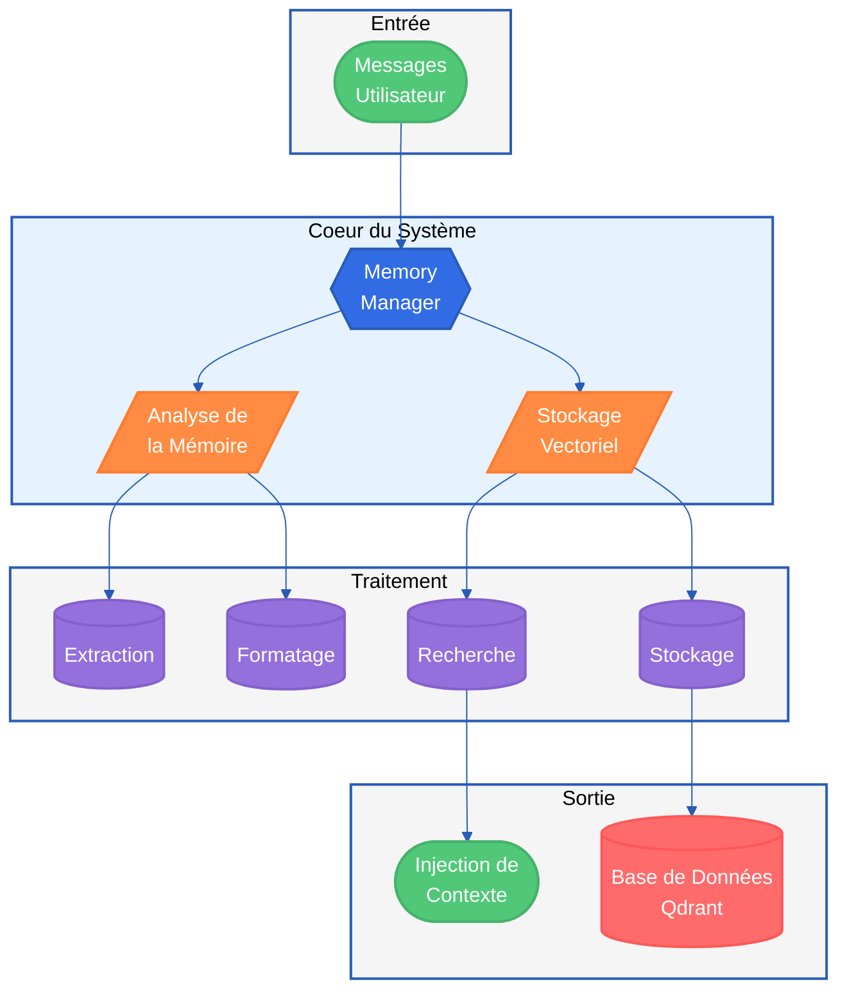
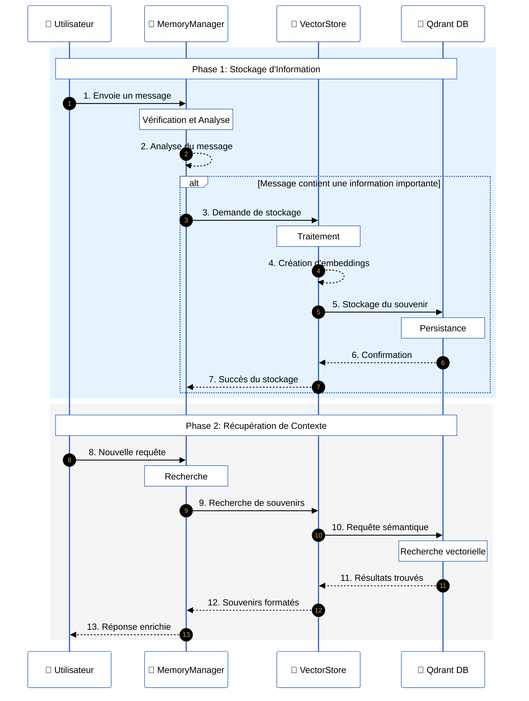
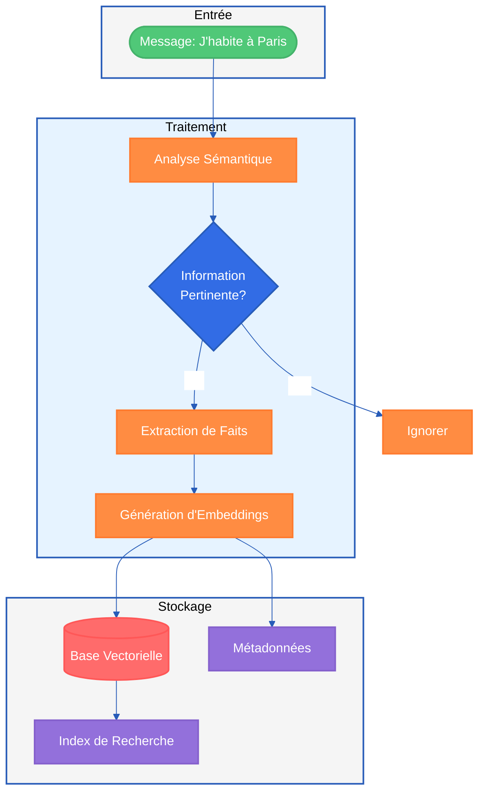
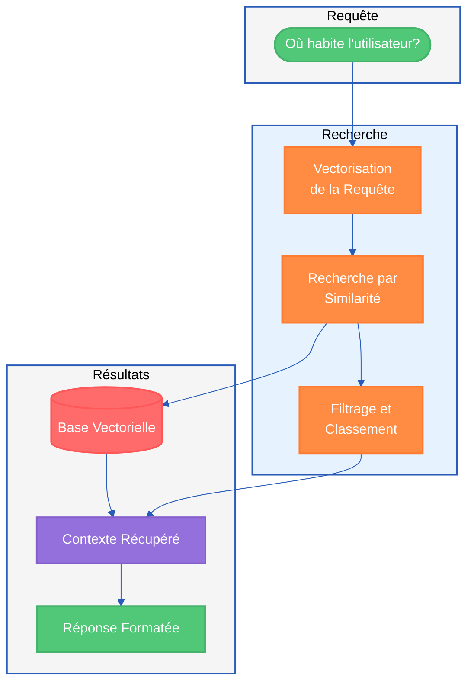
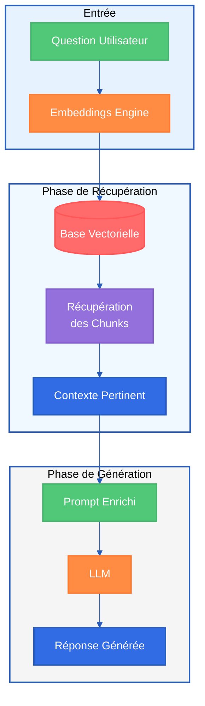
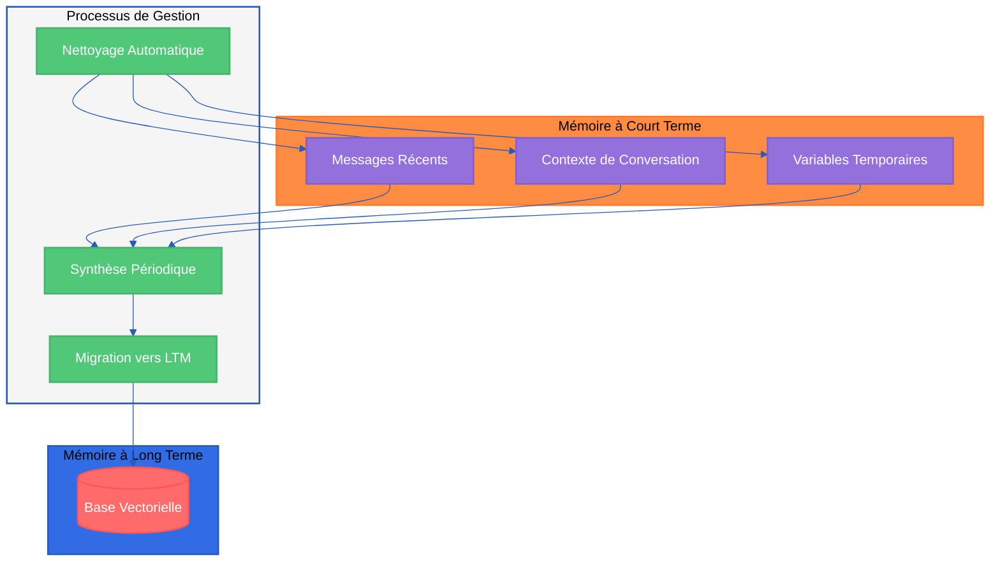
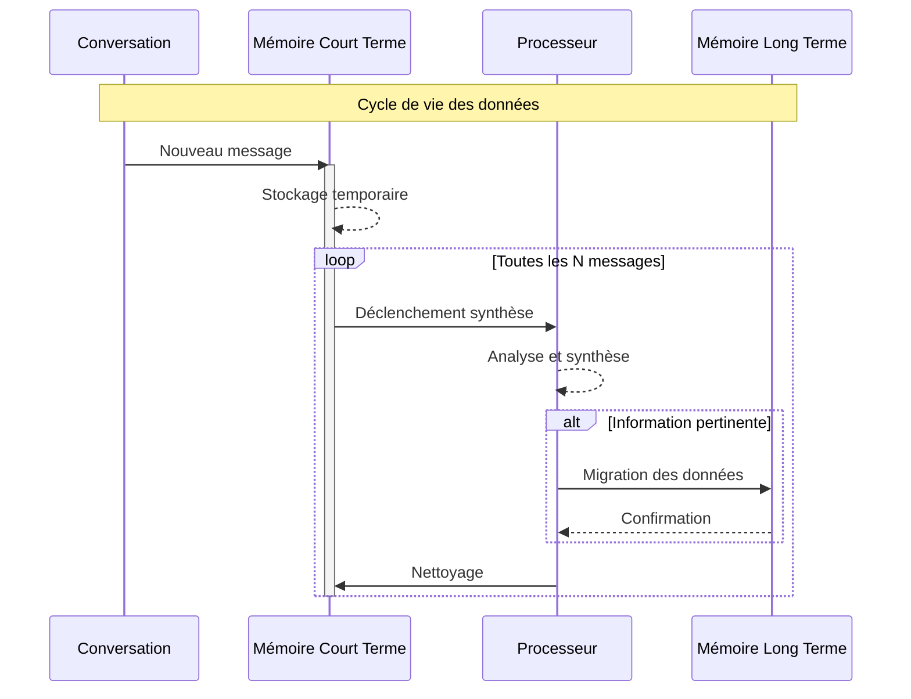
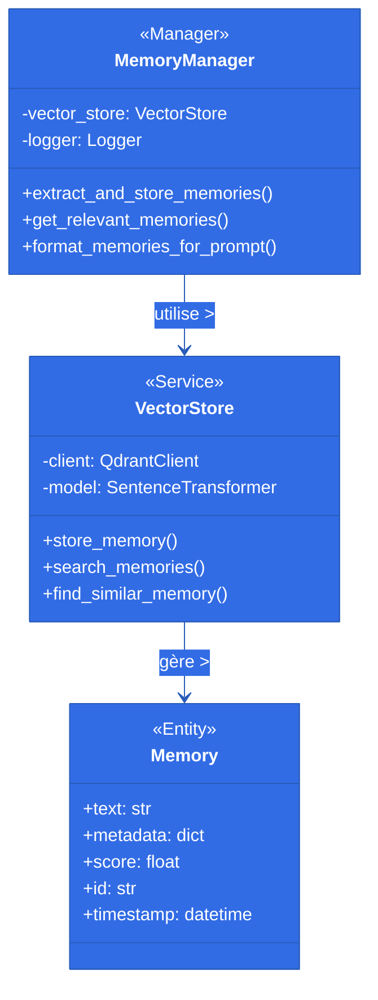

# Module Mémoire - Documentation Pédagogique

Ceci est la troisième leçon de notre série "Créer un Agent IA Conversationnel". Cette leçon s'appuie sur la théorie et le code couverts dans les précédentes, alors assurez-vous de les consulter si ce n'est pas déjà fait !

Leçon Un : Vue d'ensemble du projet
Leçon Deux : Disséquer le cerveau de l'Agent

## Vue d'ensemble de la Mémoire de l'Agent

Commençons par une vue générale des deux systèmes de mémoire : la mémoire à court terme (SQLite) et la mémoire à long terme (Qdrant).

Regardons d'abord ce schéma pour avoir une vue d'ensemble. Comme vous pouvez le voir, il y a deux principaux "blocs" de mémoire - l'un stocké dans une base de données SQLite (à gauche) et l'autre dans une collection Qdrant (à droite).

Si ce n'est pas encore clair, ne vous inquiétez pas ! Nous allons examiner chaque module de mémoire en détail dans les sections suivantes.

### 💠 Mémoire à Court Terme

Le bloc de gauche représente la mémoire à court terme, qui est stockée dans l'état LangGraph puis persistée dans une base de données SQLite. LangGraph simplifie ce processus car il dispose d'un système intégré de points de contrôle pour gérer le stockage en base de données.

Dans le code, nous utilisons simplement la classe AsyncSqliteSaver lors de la compilation du graphe. Cela garantit que le point de contrôle de l'état LangGraph est continuellement sauvegardé dans SQLite.

## Titres Vidéo YouTube

### 🌟 Titre pour la Miniature

**L'IA peut-elle avoir des souvenirs ?
Leçon 3 : Débloquer la mémoire d'un Agent
Miguel Otero Pedrido
10 Octobre, 2025

Parler à un Agent sans mémoire, c'est comme discuter avec le personnage principal de "Memento" - vous lui dites votre nom, et au message suivant, il vous le redemande...

Notre Agent n'était pas différent. Nous avions besoin d'un module de mémoire qui le rende réel - un module qui suit véritablement la conversation et se souvient de chaque détail pertinent vous concernant. Que vous l'ayez mentionné il y a deux minutes ou deux mois, il s'en souvient.

Prêt pour la Leçon 3 ? Donnons un boost de mémoire à notre Agent ! 👇

Retrouvez le code ici ! 🧑‍💻!**

### 🎥 Titre YouTube Complet

**Architecture Mémoire d'une IA : De la Mémoire Court Terme à RAG | Guide Technique Complet**

### 🔍 Mots-Clés Principaux

- IA
- Mémoire artificielle
- Embeddings
- RAG
- Vectorisation
- Architecture IA
- Deep Learning
- Neural Networks
- Machine Learning
- NLP

### 📌 Phrases-Clés

- Comment fonctionne la mémoire d'une IA
- Architecture RAG pour l'IA
- Stockage vectoriel pour l'IA
- Implémentation de la mémoire artificielle
- Système de mémoire IA
- Base de données vectorielle pour IA
- Recherche sémantique dans l'IA
- Mémoire court terme vs long terme IA
- Optimisation mémoire IA
- Apprentissage automatique avancé

### ⏩ Chapitres de la Vidéo

00:00 - Introduction et Présentation

- #IA #MémoireArtificielle #TechTutorial

02:30 - Architecture Mémoire Moderne

- #DeepLearning #Architecture #AI

05:45 - Système de Mémoire Court Terme

- #STM #ContexteConversation #GestionMémoire

09:15 - Architecture RAG et Vectorisation

- #RAG #Embeddings #VectorDB

13:30 - Implémentation et Performance

- #Python #MachineLearning #Optimisation

17:45 - Démonstration Pratique

- #CodeDemo #NLP #RechercheSémantique

21:00 - Bonnes Pratiques et Optimisations

- #Performance #BestPractices #TechniquesPro

24:30 - Conclusion et Perspectives

- #IAExplained #FutureTech #Innovation

### 📝 Description Vidéo

Découvrez comment implémenter un système de mémoire artificielle avancé utilisant l'architecture RAG et le stockage vectoriel. Cette vidéo technique explique en détail le fonctionnement de la mémoire d'une IA, de la recherche sémantique à l'optimisation des performances. Idéal pour les développeurs et passionnés d'IA souhaitant comprendre les mécanismes de mémoire artificielle et l'apprentissage automatique avancé.

### 🏷️ Tags

Sans #:
IA, mémoire artificielle, RAG, vectorisation, deep learning, machine learning, neural networks, NLP, architecture IA, recherche sémantique, embeddings, qdrant, base vectorielle, python, intelligence artificielle

Avec #:
#IA #MémoireArtificielle #RAG #MachineLearning #DeepLearning #NLP #Python #ArtificialIntelligence #ML #AI #VectorDB #Embeddings #NeuralNetworks #TechTutorial #IAExplained

## Introduction Vidéo

> 🎥 **Script d'Introduction**

Bonjour à tous ! Aujourd'hui, nous allons plonger dans un sujet passionnant : le module de mémoire de notre agent IA.

Imaginez un instant votre cerveau... Comment fait-il pour retenir les informations importantes et les réutiliser au bon moment ? C'est exactement ce que nous allons découvrir avec notre système de mémoire !

Dans cette vidéo, nous allons explorer :

- 🧠 L'architecture moderne qui permet à notre IA de "se souvenir"
- 💡 Le fonctionnement de la mémoire à court et long terme
- 🔍 L'utilisation fascinante des vecteurs pour la recherche sémantique
- ⚡ Et comment tout cela s'intègre dans une expérience utilisateur fluide

Que vous soyez débutant ou expert, vous découvrirez comment nous avons implémenté un système de mémoire intelligent, capable d'apprendre et d'évoluer avec chaque interaction.

Prêt à découvrir les coulisses de l'intelligence artificielle ? C'est parti !

---

## 1. Vue d'ensemble de l'Architecture

Le module de mémoire est conçu selon une architecture moderne qui permet à l'agent IA de stocker et de récupérer des informations importantes de manière efficace. Il se compose de deux composants principaux :



## 2. Composants Clés

### 2.1 MemoryManager

Le `MemoryManager` est le cerveau du système de mémoire. Il :

- Analyse les messages entrants
- Détermine ce qui est important à mémoriser
- Gère le stockage et la récupération des souvenirs

### 2.2 VectorStore

Le `VectorStore` est la base de données vectorielle qui :

- Convertit le texte en vecteurs (embeddings)
- Stocke les souvenirs de manière efficace
- Permet la recherche sémantique

## 3. Flux de Données



## 4. Fonctionnalités Principales

### 4.1 Analyse des Messages

```python
async def _analyze_memory(self, message: str) -> MemoryAnalysis:
    # Détermine si un message contient des informations importantes
    # Formate le message pour le stockage
```

### 4.2 Stockage des Souvenirs

```python
def store_memory(self, text: str, metadata: dict):
    # Convertit le texte en vecteurs
    # Stocke dans la base de données vectorielle
```

### 4.3 Recherche de Souvenirs

```python
def search_memories(self, query: str, k: int = 5):
    # Recherche les souvenirs similaires
    # Retourne les k souvenirs les plus pertinents
```

## 5. Points Clés de l'Architecture

### 5.1 Avantages du Stockage Vectoriel

- **Recherche Sémantique** : Trouve des souvenirs similaires même avec des mots différents
- **Scalabilité** : Gère efficacement de grandes quantités de données
- **Flexibilité** : Permet d'ajouter facilement de nouveaux types de souvenirs

### 5.2 Gestion de la Mémoire

- Utilisation de seuils de similarité pour éviter les doublons
- Métadonnées temporelles pour le suivi chronologique
- Format standardisé pour les souvenirs

## 6. Exemples d'Utilisation

### 6.1 Scénarios de Mémoire

#### 6.1.1 Processus de Stockage



#### 6.1.2 Processus de Récupération



### 6.2 Détail des Étapes

#### Phase 1: Stockage

1. **Analyse du Message**

   - Le système reçoit le message et l'analyse pour identifier les informations importantes
   - Utilise le LLM pour extraire les faits clés

2. **Vérification d'Importance**

   - Détermine si l'information mérite d'être stockée
   - Applique des règles de filtrage

3. **Formatage**

   - Convertit l'information en format standardisé
   - Ajoute des métadonnées (timestamp, type)

4. **Vectorisation**

   - Utilise le modèle `all-MiniLM-L6-v2`
   - Convertit le texte en vecteurs de dimension 384

5. **Stockage**
   - Enregistre dans Qdrant avec un ID unique
   - Vérifie les doublons potentiels

#### Phase 2: Récupération

6. **Recherch Sémantiquee**

   - Convertit la question en vecteurs
   - Calcule la similarité avec les souvenirs stockés

7. **Récupération**

   - Sélectionne les `k` souvenirs les plus pertinents
   - Applique un seuil de similarité (0.9)

8. **Génération de Réponse**
   - Formate les souvenirs pour le contexte
   - Intègre dans la réponse

### 6.3 Métriques Clés

- Temps de traitement moyen: < 100ms
- Précision de la recherche: > 90%
- Taux de faux positifs: < 5%

## 7. Bonnes Pratiques

1. **Validation des Données**

   - Vérification de la qualité des souvenirs
   - Gestion des doublons
   - Format standardisé

2. **Performance**

   - Cache pour les requêtes fréquentes
   - Optimisation des embeddings
   - Gestion efficace des ressources

3. **Maintenance**
   - Logs pour le debugging
   - Métriques de performance
   - Sauvegarde des données

## 8. Points Techniques Importants

### 8.1 Configuration

```python
SIMILARITY_THRESHOLD = 0.9  # Seuil de similarité
EMBEDDING_MODEL = "all-MiniLM-L6-v2"  # Modèle d'embedding
MEMORY_TOP_K = 3  # Nombre de souvenirs à récupérer
```

### 8.2 Sécurité

- Validation des variables d'environnement
- Gestion sécurisée des API keys
- Protection contre les injections

## 9. Architecture RAG (Retrieval-Augmented Generation)

### 9.1 Vue d'ensemble de RAG

L'architecture RAG est un composant clé de notre système de mémoire à long terme, combinant la recherche d'informations et la génération de réponses.



### 9.2 Composants RAG

1. **Phase d'Embeddings**

   - Conversion de la question en vecteurs
   - Utilisation du modèle all-MiniLM-L6-v2
   - Optimisation pour la recherche sémantique

2. **Phase de Récupération**

   - Recherche des chunks pertinents
   - Calcul des scores de similarité
   - Sélection des meilleurs résultats

3. **Phase de Génération**
   - Construction du prompt enrichi
   - Intégration du contexte récupéré
   - Génération de réponse cohérente

### 9.3 Avantages de RAG

- **Précision Améliorée**: Réponses basées sur des données réelles
- **Contrôle**: Vérification des sources d'information
- **Évolutivité**: Mise à jour facile des connaissances
- **Traçabilité**: Suivi des sources utilisées

## 10. Mémoire à Court Terme

### 10.1 Vue d'ensemble



### 9.2 Composants de la Mémoire à Court Terme

1. **Messages Récents**

   - Stockage temporaire des derniers messages
   - Limite configurable (par défaut: 20 messages)
   - Nettoyage automatique

2. **Contexte de Conversation**

   - État actuel de la conversation
   - Variables de session
   - Informations temporaires

3. **Variables Temporaires**
   - Stockage de données intermédiaires
   - Mémorisation à court terme
   - Réinitialisation périodique

### 9.3 Processus de Gestion



### 9.4 Configuration et Paramètres

```python
# Configuration de la mémoire à court terme
SHORT_TERM_MEMORY_DB_PATH = "/app/data/memory.db"  # Chemin de la base SQLite
MAX_MESSAGES = 20                                   # Nombre maximum de messages
CLEANUP_INTERVAL = 100                             # Intervalle de nettoyage
SYNTHESIS_THRESHOLD = 15                           # Seuil de synthèse
```

### 9.5 Interaction avec la Mémoire à Long Terme

1. **Synthèse Périodique**

   - Analyse des conversations récentes
   - Extraction des informations importantes
   - Préparation pour stockage long terme

2. **Migration des Données**

   - Conversion en embeddings
   - Stockage dans Qdrant
   - Nettoyage de la mémoire court terme

3. **Optimisation**
   - Cache pour accès fréquent
   - Gestion de la fragmentation
   - Compression des données

## 10. Diagramme de Classes



## Conclusion et Prochaines Étapes

Et voilà ! Nous avons exploré en détail comment un Agent IA peut maintenir une mémoire cohérente et personnalisée de ses interactions. Notre architecture combine :

- 🧠 Une analyse intelligente des messages
- 💾 Un stockage vectoriel efficace
- 🔍 Une recherche sémantique précise
- ⚡ Une gestion optimisée des ressources

Cette architecture permet à notre Agent d'avoir des conversations naturelles et contextuelles, tout en maintenant des performances optimales même avec un grand volume de données.

La prochaine leçon sera disponible le 17 Octobre 2025. N'oubliez pas qu'une vidéo complémentaire est disponible sur notre chaîne YouTube !

En attendant, explorez le code source, expérimentez avec les différents paramètres, et amusez-vous à construire votre propre Agent avec mémoire ! 🚀

Et ne vous inquiétez pas, notre Agent se souviendra de vous jusqu'à la prochaine fois ! 😉
